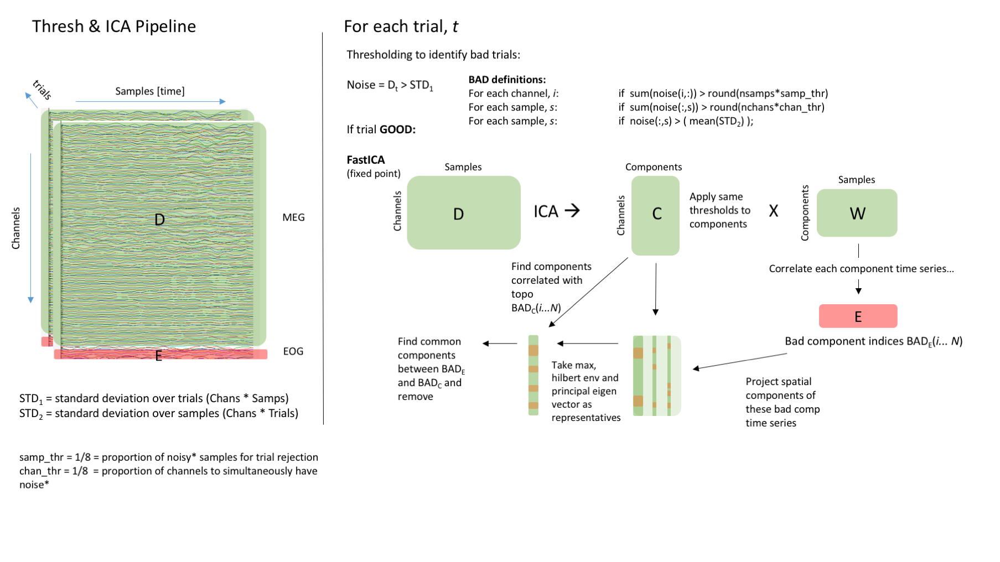

# ICA_CTF

An implementation of the FastICA algorithm for (epoched) CTF MEG data that has EOG and/or other peripheral (e.g. EMG) channel recordings. Generates subject specific topographies on the fly.

Example usage:
```
FastICA_CTF_SpatioTemp(MEG_Cut.ds,NC,UL,'_ica',1) % specify num comps, max to reject & write logfile
FastICA_CTF_SpatioTemp(MEG_Cut.ds,[],[],'_ica',0) % use defaults and print to matlab
```
 Inputs:
         Dname = (epoched) CTF .ds dataset
         NC    = number of components in data (optional, def = num chans)
         UL    = upper limit on number of comps to reject (optional)
         fname = output dataset appendix, e.g. 'ICA' for MEG_Cut_ICA.ds
         bonf  = flag for bonferonni correction (def 0)
         
         writelog = flag (0/1) to write to console (default) or a logfile

Overview.


